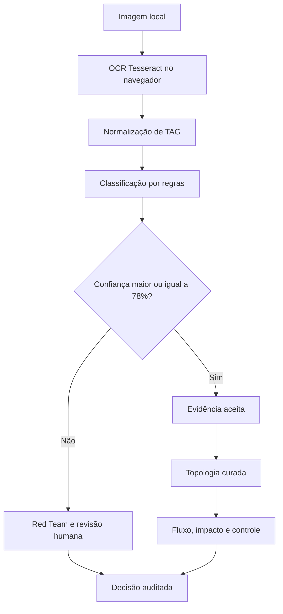

# ThLoop Atlas P&ID Lens

Prova de conceito local para análise auditável de diagramas P&ID. A aplicação localiza TAGs por OCR neural, sugere classes, projeta evidências sobre o documento e encaminha resultados incertos para revisão humana.

Projeto desenvolvido por **Matheus Sousa dos Santos**, Equipe **ThLoop**.

## O que a demo entrega

- Interface industrial responsiva para desktop, tablet e celular.
- Seis amostras reais selecionadas do dataset fornecido.
- OCR neural executado no navegador com Tesseract.js e ativos offline.
- Classificação explicável de equipamentos, instrumentos, válvulas e TAGs.
- Overlays clicáveis com bounding boxes, confiança, origem e justificativa.
- Diagrama e topologia sincronizados pelo mesmo identificador de evidência.
- Traçado de quatro rotas curadas sobre documento e grafo.
- Mapa de impacto a montante e a jusante com confirmação humana.
- Contextos visuais de controle e monitoramento sem alegar lógica operacional.
- Mapa de calor de confiança e legenda de incerteza.
- Biblioteca visual com miniaturas dos seis exemplares locais.
- Gate de confiança em 78% e fila de revisão humana.
- Memória e linha do tempo de auditoria persistidas apenas no navegador.
- Exportação local de resultados em JSON.
- Métricas da sessão e matriz inicial explicitamente marcada como demonstrativa.
- Roteiro interativo para uma apresentação de 15 minutos.

Nenhuma chave de API é necessária. A demo não envia imagens, recortes ou resultados para NVIDIA, OpenAI ou qualquer outro serviço externo.

## Início rápido no Windows

Pré-requisito: [Node.js 22 ou superior](https://nodejs.org/).

1. Extraia o projeto em uma pasta local.
2. Execute `start-demo.bat`.
3. Aguarde a instalação inicial das dependências.
4. Abra no navegador o endereço exibido no terminal.

Também é possível iniciar manualmente:

```powershell
npm install
npm run dev
```

Chrome e Edge atuais são os navegadores recomendados. O primeiro OCR pode levar alguns segundos porque o motor e o modelo offline são carregados na memória do navegador.

## Início rápido no Linux ou macOS

```bash
chmod +x start-demo.sh
./start-demo.sh
```

## Fluxo sugerido de 15 minutos

| Tempo | Tela | Mensagem principal |
|---:|---|---|
| 2 min | Visão geral | O problema não é apenas detectar símbolos. É produzir evidência confiável sem expor dados industriais. |
| 3 min | Análise | Mostre a referência curada, execute o OCR local e inspecione os overlays sobre um documento real. |
| 4 min | Topologia e impacto | Trace uma rota, selecione P-03 e confirme o escopo topológico. |
| 2 min | Revisão humana | Aceite ou rejeite uma ocorrência abaixo do gate e mostre o evento na trilha. |
| 2 min | Métricas | Diferencie medições da sessão e a matriz demonstrativa de calibração. |
| 2 min | Atlas Console | Feche com governança, agentes, Red Team, memória e soberania humana. |

O botão **Roteiro de 15 min** abre este fluxo dentro da própria aplicação.

## Como os conceitos do Atlas aparecem no produto

| Conceito do Atlas | Implementação nesta demo |
|---|---|
| Blueprint primeiro | Escopo, contratos, gates e topologia foram aprovados antes da implementação. |
| Constituição | Privacidade local, evidência obrigatória, honestidade e autoridade humana são invariantes. |
| Memória de projeto | Decisões e correções ficam persistidas em `localStorage`, com chave versionada. |
| ADR | O runtime local e a topologia curada estão registrados em `docs/ADR-001-LOCAL-FIRST.md` e `docs/ADR-002-CURATED-TOPOLOGY.md`. |
| Manifesto de agentes | Cinco papéis têm responsabilidade e níveis de autoridade explícitos. |
| Red Team | Baixa confiança e falhas do OCR permanecem visíveis, sem resultados inventados. |
| Soberania humana | A IA recomenda; Matheus decide o que entra no conjunto aceito. |
| Soberania de dados | Tesseract, modelo de idioma e imagens são servidos pelo próprio projeto. |

Os documentos de governança estão em `docs/`.

## Arquitetura



O arquivo principal da experiência está em `app/components/PIDLensApp.tsx`. Os visuais semânticos estão em `app/components/VisualIntelligence.tsx`. O pipeline OCR está em `app/lib/local-ocr.ts`, e a topologia curada está em `app/lib/topology-data.ts`.

## Comandos

```bash
npm run dev          # servidor local
npm run lint         # análise estática
npm run typecheck    # verificação TypeScript
npm test             # lint + typecheck + teste do classificador local
npm run build        # build de produção
npm run start        # inicia o build produzido
```

## Limites assumidos com honestidade

- O material recebido não contém anotações oficiais ou ground truth.
- As 31 evidências da amostra `16.jpg` foram curadas para sustentar uma apresentação estável.
- O OCR ao vivo é real, mas seus resultados variam com resolução, contraste, rotação e densidade do desenho.
- A matriz de confusão da tela de métricas é uma calibração demonstrativa. Ela não deve ser apresentada como benchmark oficial.
- Rotas, impacto e contextos de controle da referência são uma camada curada para demonstração. Não representam causalidade, lógica de intertravamento ou instrução operacional.
- Símbolos gráficos ainda não são classificados por um detector treinado. Nesta versão, a classificação parte de TAGs reconhecidas e regras de prefixo.
- Para uma versão de produção, o próximo passo é rotular o dataset com especialista, treinar um detector de símbolos e validar por classe.

## Estrutura essencial

```text
app/
  components/PIDLensApp.tsx
  components/VisualIntelligence.tsx
  lib/demo-data.ts
  lib/local-ocr.ts
  lib/topology-data.ts
docs/
  BLUEPRINT.md
  CONSTITUTION.md
  AGENT_MANIFEST.md
  ADR-001-LOCAL-FIRST.md
  ADR-002-CURATED-TOPOLOGY.md
public/
  samples/
  tessdata/
  tesseract-core/
start-demo.bat
start-demo.sh
```

## Privacidade

A política da demo é local-first. Não há endpoint de upload, telemetria de produto, analytics ou integração de IA em nuvem. O navegador só solicita arquivos estáticos ao servidor local iniciado pelo próprio projeto.

Licença e identidade visual final podem ser definidas pela Equipe ThLoop antes de uma publicação pública.
