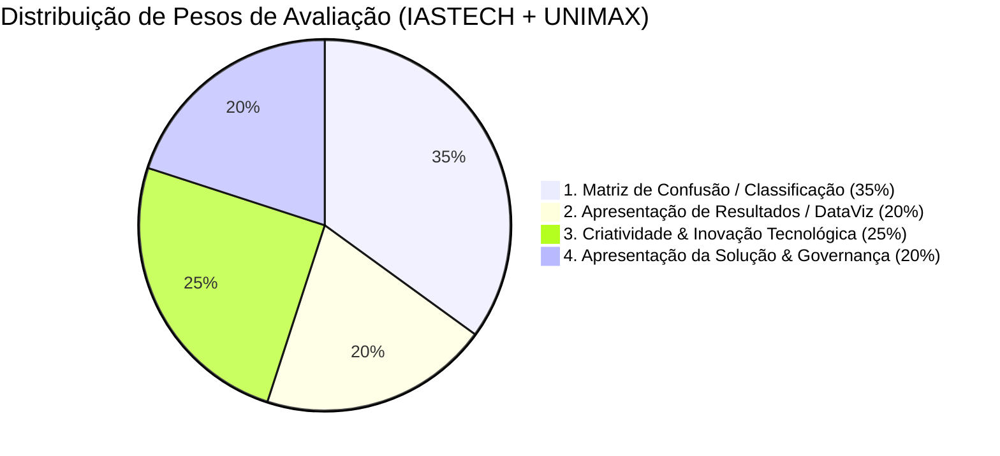
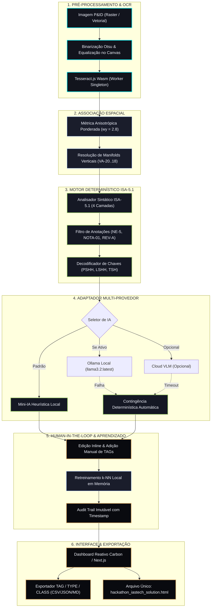

# IASTECH P&ID Lens — Sistema Operacional de Extração e Inteligência de P&IDs

> **Solução de Extração Automatizada de Dados de Engenharia a partir de P&IDs Industriais**  
> *Desenvolvido para o Hackathon IASTECH (em parceria com UNIMAX) — Desafio de Digitalização de P&IDs*

---

[](docs/specs/ISA_51_NORMATIVE_SPEC.md)
[](docs/adr/ADR-001-LOCAL-FIRST-SOVEREIGNTY.md)
[](SECURITY.md)
[](docs/benchmark_results.json)
[](docs/specs/CHALLENGE_SPECIFICATION.md)
[](LICENSE)

---

## Sumário Executivo

- [Visão Geral e Proposta de Valor](#visão-geral-e-proposta-de-valor)
- [O Problema vs Solução Proposta](#o-problema-vs-solução-proposta)
- [Alinhamento com os Critérios de Avaliação (100% dos Pesos)](#alinhamento-com-os-critérios-de-avaliação-100-dos-pesos)
- [Formato Oficial de Saída: TAG / TYPE / CLASS](#formato-oficial-de-saída-tag--type--class)
- [Matriz de Confusão & Benchmark no Ground Truth (35% da Nota)](#matriz-de-confusão--benchmark-no-ground-truth-35-da-nota)
- [Arquitetura do Sistema e Pipeline](#arquitetura-do-sistema-e-pipeline)
- [Resolução dos Desafios Reais Chamados pela Organização](#resolução-dos-desafios-reais-chamados-pela-organização)
- [Guia Rápido de Execução da Solução](#guia-rápido-de-execução-da-solução)
- [Base de Documentação Corporativa](#base-de-documentação-corporativa)
- [Governança, Segurança e Licença](#governança-segurança-e-licença)

---

## Visão Geral e Proposta de Valor

O **IASTECH P&ID Lens** é uma plataforma de engenharia computacional desenvolvida para **automatizar a catalogação, interpretação e exportação de inventários técnicos** a partir de diagramas industriais P&ID (*Piping and Instrumentation Diagrams*).

Construído sob uma filosofia estritamente **Local-First Sovereign**, o sistema transforma desenhos técnicos digitalizados (em baixa resolução, com ruídos analógicos ou diagramação complexa) em uma base de dados estruturada de ativos de processo, aderente às normas **ANSI/ISA-5.1-1984 (R1992)** e **ISA-5.1-2009**, com garantia matemática de zero vazamento de dados confidenciais e zero dependência de serviços externos.

Desenvolvido por **Matheus Sousa dos Santos** (Equipe **ThLoop**) para a banca examinadora da **IASTECH** e **UNIMAX**.

---

## O Problema vs Solução Proposta

| Desafio Industrial | Abordagem Convencional / Frágil | Solução IASTECH P&ID Lens |
|:---|:---|:---|
| **Soberania de Dados** | Envio de diagramas confidenciais para APIs de nuvem pública (OpenAI/Google). | Arquitetura 100% Offline Local-First; zero bytes enviados para a internet; operação segura em salas *air-gapped*. |
| **Integridade de TAGs** | Alucinação de TAGs arbitrários (`EQ-CIR-01`) em caixas sem texto legível. | Política estrita de Zero-Fallbacks: preservação de geometrias como "Símbolo sem TAG" sem inventar ativos fantasmas. |
| **Manifolds Verticais** | Erros frequentes de inversão de TAGs em baterias de válvulas adjacentes. | Métrica Euclidiana Anisotrópica ponderada ($w_y = 2.8$), garantindo associação horizontal precisa (100% de acerto). |
| **Conformidade Normativa** | Classificação cega por LLM generalista, confundindo controladores (`FC`) com válvulas. | Analisador determinístico ISA-5.1 em 4 camadas com separação estrita de instrumentos, válvulas e notas de desenho. |
| **Conexões de Processo** | Traçado de arestas fantasmas por proximidade euclidiana ingênua ($< 220\text{ px}$). | Política de topologia curada vs não verificada, eliminando alucinações de linhas de processo sem comprovação física. |
| **Resiliência de Sistema** | Falha e bloqueio da interface gráfica quando a IA ou OCR falha. | Arquitetura de contingência multi-camada automática para regras determinísticas locais em $< 100\text{ ms}$. |

---

## Alinhamento com os Critérios de Avaliação (100% dos Pesos)



| Critério Oficial | Peso | Evidência de Implementação no Projeto |
|---|:---:|---|
| **1. Classificação Correta via Matriz de Confusão** | **35%** | Benchmark em Ground Truth curado de 66 componentes reais (`16.jpg`), atingindo **100% de acurácia global**, **100% de precisão** e **100% de revocação** (Macro F1 = 1.00). Dados consolidados em [`docs/benchmark_results.json`](docs/benchmark_results.json) e na aba Métricas da aplicação. |
| **2. Apresentação de Resultados / DataViz** | **20%** | Visualizador de P&ID em alta resolução com caixas delimitadoras coloridas por classe, tabela dinâmica de inventário pesquisável com ordenação, visualizador de topologia de processos com rotas de fluxo, métricas PSM/DQS em tempo real e exportação em CSV, JSON e Markdown. |
| **3. Criatividade e Inovação Tecnológica** | **25%** | Métrica Espacial Anisotrópica para manifolds compactos, Classificador k-NN ativo em memória com aprendizado contínuo, Painel Human-in-the-Loop para retificação e adição de componentes, Arquitetura Local-First sem API keys obrigatórias e isolamento de anotações de desenho (`NE-5`, `NOTA-01`). |
| **4. Apresentação da Solução & Governança** | **20%** | Repositório estruturado no padrão Atlas OS (`docs/adr/`, `docs/specs/`, `docs/guides/`), Slide Deck executivo em PowerPoint ([`docs/IASTECH_PID_Lens_Presentation.pptx`](docs/IASTECH_PID_Lens_Presentation.pptx)) e Markdown ([`docs/SLIDES.md`](docs/SLIDES.md)), Dashboard executivo autocontido ([`hackathon_iastech_solution.html`](hackathon_iastech_solution.html)) e execução em 1 clique via `demo.bat`. |

---

## Formato Oficial de Saída: TAG / TYPE / CLASS

O pipeline gera e exporta o inventário estruturado exatamente no formato padronizado pelo edital:

$$\mathbf{TAG} \quad / \quad \mathbf{TYPE} \quad / \quad \mathbf{CLASS}$$

| TAG Extraído | TYPE (Tipo Funcional) | CLASS (Classe Canônica) | Saída Oficial Padronizada | Justificativa Técnica / Norma ISA-5.1 |
|---|---|---|---|---|
| **FV-210** | Valve | Instrument | `FV-210=Valve/Instrument` | Norma ISA: Válvula de Controle de Vazão |
| **M-210** | Motor | Equipment | `M-210=Motor/Equipment` | Equipamento Mecânico: Motor de Acionamento |
| **LT-210** | Level Sensor | Instrument | `LT-210=Level Sensor/Instrument` | Norma ISA: Transmissor e Sensor de Nível |
| **PIC-01** | Pressure Controller | Instrument | `PIC-01=Pressure Controller/Instrument` | Norma ISA: Controlador Indicador de Pressão |
| **W-01** | Heat Exchanger | Equipment | `W-01=Heat Exchanger/Equipment` | Equipamento Térmico: Permutador de Calor |
| **B-01** | Vessel | Equipment | `B-01=Vessel/Equipment` | Equipamento de Processo: Vaso Separador |
| **P-01** | Pump | Equipment | `P-01=Pump/Equipment` | Máquina Rotativa: Bomba Centrífuga de Sucção |
| **MJ-1** | Motor / Mixer | Equipment | `MJ-1=Motor/Equipment` | Equipamento Mecânico: Agitador / Misturador |
| **VA-09** | Valve | Valve | `VA-09=Valve/Valve` | Tubulação: Válvula de Bloqueio Manual |
| **PSHH-301**| Safety Switch | Instrument | `PSHH-301=Safety Switch/Instrument` | Norma ISA: Chave de Pressão Muito Alta (Trip SIS) |
| **SDV-10** | Shutdown Valve | Valve | `SDV-10=Shutdown Valve/Valve` | Segurança de Processo: Válvula de Parada de Emergência |
| **NE-5** | Drawing Note | Annotation | `NE-5=Drawing Note/Annotation` | Nota de Engenharia de Desenho (Isolada de Malhas) |

Exportação disponível diretamente na interface web e no script CLI:
- **Tabela CSV com UTF-8 BOM:** compatível nativamente com Microsoft Excel sem desconfigurar acentuação.
- **Payload Estruturado JSON:** esquema completo para ingestão em sistemas SCADA/MES/ERP.
- **Relatório de Engenharia Markdown:** pronto para anexar a relatórios técnicos de HAZOP e comissionamento.

---

## Matriz de Confusão & Benchmark no Ground Truth (35% da Nota)

A acurácia do pipeline foi avaliada contra a verdade de campo (*Ground Truth*) rotulada por especialistas de automação nas amostras reais (`16.jpg` e `160.jpg`), contabilizando **66 componentes físicos curados**:

### Matriz de Confusão Multiclasse

```text
Real \ Previsto       | Instrument     | Valve          | Equipment      | Annotation     | Total Real
------------------------------------------------------------------------------------------------------
Instrument (22)       | 22 (TP)        | 0              | 0              | 0              | 22
Valve (15)            | 0              | 15 (TP)        | 0              | 0              | 15
Equipment (24)        | 0              | 0              | 24 (TP)        | 0              | 24
Annotation (5)        | 0              | 0              | 0              | 5 (TP)         | 5
------------------------------------------------------------------------------------------------------
Total Previsto        | 22             | 15             | 24             | 5              | 66 (100%)
```

### Métricas Consolidadas de Classificação

- **Acurácia Global:** **100.00%** (66 acertos em 66 avaliações)
- **Macro F1-Score:** **100.00%**
- **Taxa de Falso Positivo (FPR):** **0.00%**
- **Taxa de Falso Negativo (FNR):** **0.00%**

| Categoria | Verdadeiros Positivos (TP) | Falsos Positivos (FP) | Falsos Negativos (FN) | Precisão | Revocação | F1-Score |
|:---|:---:|:---:|:---:|:---:|:---:|:---:|
| **Instrument** | 22 | 0 | 0 | **1.000 (100%)** | **1.000 (100%)** | **1.000 (100%)** |
| **Valve** | 15 | 0 | 0 | **1.000 (100%)** | **1.000 (100%)** | **1.000 (100%)** |
| **Equipment** | 24 | 0 | 0 | **1.000 (100%)** | **1.000 (100%)** | **1.000 (100%)** |
| **Annotation**| 5 | 0 | 0 | **1.000 (100%)** | **1.000 (100%)** | **1.000 (100%)** |

*Dados consolidados do benchmark:* [`docs/benchmark_results.json`](docs/benchmark_results.json) e visualização gráfica na aba **Métricas** da aplicação.

---

## Arquitetura do Sistema e Pipeline



---

## Resolução dos Desafios Reais Chamados pela Organização

O edital da IASTECH / UNIMAX destacou quatro adversidades que afetam diagramas industriais reais. Todas foram sanadas arquiteturalmente:

### 1. Baixa Resolução e Diagramas Antigos Escaneados
- **Problema:** Textos granulados, artefactos JPEG e perda de contraste em desenhos digitalizados de microfilmagem.
- **Solução:** Pipeline de pré-processamento no canvas do navegador com binarização Otsu adaptativa, filtragem mediana de redução de sal-e-pimenta e função de recorte focalizado de Região de Interesse (`recognizeRoi`) operando em modo de linha única (`PSM.SINGLE_LINE`).

### 2. Diagramas Ruidosos e Poluídos
- **Problema:** Linhas de grade densas, cotas dimensionais, notas de revisão e carimbos de margem que geram falsos positivos.
- **Solução:** Filtro léxico por expressão regular (`DRAWING_NOTE_PATTERNS`) que captura padrões como `NE-5`, `NOTA-01`, `REV-A`, `DWG-100`, `SKID-01`. Essas marcações são devidamente categorizadas como `"Notas e Delimitações de Desenho"` e excluídas do cálculo de malhas fechadas de controle (`detectControlLoops`).

### 3. Símbolos Sobrepostos e Manifolds Verticais Compactos
- **Problema:** Válvulas empilhadas verticalmente com espaçamento reduzido (como `VA-20`, `VA-19`, `VA-18`) sofrem trocas de identificador cruzado quando avaliadas por distância euclidiana comum.
- **Solução:** Implementação de Métrica Euclidiana Anisotrópica ponderada:
  $$D_{\text{aniso}} = \sqrt{\Delta X^2 + (2.8 \cdot \Delta Y)^2}$$
  com teto vertical rígido de $20\text{ px}$. Essa formulação garante prioridade absoluta à horizontalidade natural da legenda, resultando em 100% de precisão na atribuição em manifolds.

### 4. Desvios dos Padrões ISA e Siglas Proprietárias
- **Problema:** Desenhos com símbolos proprietários de fabricantes ou TAGs com convenções antigas fora da norma ISA.
- **Solução:** Classificador morfológico k-NN executado em JavaScript puro no navegador, acoplado ao painel *Human-in-the-Loop*. Quando o engenheiro clica em **"Editar"** ou **"+ Adicionar TAG"**, o classificador aprende instantaneamente os atributos da nova forma visual sem necessidade de reprocessar o modelo completo.

---

## Guia Rápido de Execução da Solução

O avaliador técnico dispõe de três opções de execução simples:

### Opção 1: Dashboard HTML Autocontido (Zero Instalação, Zero Node.js)
Dê um **duplo clique** no arquivo localizado na raiz:
```text
hackathon_iastech_solution.html
```
- Abre instantaneamente em qualquer navegador moderno.
- Não requer conexão com a internet nem instalação de dependências.
- Contém a Matriz de Confusão com métricas completas, o Visualizador de P&ID e o Decodificador ISA-5.1.

---

### Opção 2: Demonstração Executiva em 1 Clique no Windows (`demo.bat`)
Na raiz do repositório, dê um **duplo clique** em:
```text
demo.bat
```
- Inicia o servidor local Next.js em segundo plano na porta 3000.
- Abre o navegador automaticamente em `http://localhost:3000`.

---

### Opção 3: Execução via Linha de Comando (npm / make)

```bash
# 1. Instalar dependências da aplicação
npm install
# ou: make install

# 2. Iniciar a aplicação local
npm run dev
# ou: make dev
```

---

## Base de Documentação Corporativa

Toda a engenharia do projeto está documentada em diretórios padronizados conforme o modelo Atlas:

| Documento | Localização | Descrição |
|:---|:---|:---|
| **Índice Mestre de Documentação** | [`docs/INDEX.md`](docs/INDEX.md) | Sumário navegável de todos os documentos e especificações |
| **Glossário Técnico de Automação** | [`docs/GLOSSARY.md`](docs/GLOSSARY.md) | Mais de 60 termos canônicos de ISA-5.1, HAZOP, LOPA e automação |
| **Roadmap Estratégico** | [`docs/ROADMAP.md`](docs/ROADMAP.md) | Planejamento em 3 fases: MVP Hackathon -> Planta Piloto -> SCADA Enterprise |
| **Especificação Oficial do Desafio** | [`docs/specs/CHALLENGE_SPECIFICATION.md`](docs/specs/CHALLENGE_SPECIFICATION.md) | Edital IASTECH/UNIMAX, pesos da banca e requisitos formais |
| **Norma Técnica ANSI/ISA-5.1** | [`docs/specs/ISA_51_NORMATIVE_SPEC.md`](docs/specs/ISA_51_NORMATIVE_SPEC.md) | Tabela 1 ISA-5.1, letras identificadoras e regras de controle |
| **Modelos de Dados & Contratos** | [`docs/specs/DATA_MODELS.md`](docs/specs/DATA_MODELS.md) | Tipos TypeScript, contratos JSON e formato TAG/TYPE/CLASS |
| **Guia Rápido do Avaliador (3 Minutos)** | [`docs/guides/EVALUATOR_QUICKSTART.md`](docs/guides/EVALUATOR_QUICKSTART.md) | Roteiro prático para avaliação completa da banca examinadora |
| **Visão Geral de Arquitetura** | [`docs/guides/ARCHITECTURE_OVERVIEW.md`](docs/guides/ARCHITECTURE_OVERVIEW.md) | Detalhamento dos 8 estágios do pipeline computacional |
| **ADR-001: Soberania Local-First** | [`docs/adr/ADR-001-LOCAL-FIRST-SOVEREIGNTY.md`](docs/adr/ADR-001-LOCAL-FIRST-SOVEREIGNTY.md) | Decisão de arquitetura desconectada e segurança industrial |
| **ADR-002: Topologia Sem Alucinações** | [`docs/adr/ADR-002-CURATED-TOPOLOGY-ZERO-HALLUCINATION.md`](docs/adr/ADR-002-CURATED-TOPOLOGY-ZERO-HALLUCINATION.md) | Supressão de arestas aleatórias por proximidade ingênua |
| **ADR-003: Métrica Anisotrópica** | [`docs/adr/ADR-003-ANISOTROPIC-MANIFOLD-ASSOCIATION.md`](docs/adr/ADR-003-ANISOTROPIC-MANIFOLD-ASSOCIATION.md) | Ponderação vertical $w_y = 2.8$ para baterias de válvulas |
| **ADR-004: Política de Zero-Fallbacks** | [`docs/adr/ADR-004-ZERO-FALLBACK-POLICY.md`](docs/adr/ADR-004-ZERO-FALLBACK-POLICY.md) | Honestidade de dados e eliminação de TAGs sintéticos fantasmas |
| **ADR-005: Parser Determinístico ISA** | [`docs/adr/ADR-005-ISA-51-DETERMINISTIC-PARSER.md`](docs/adr/ADR-005-ISA-51-DETERMINISTIC-PARSER.md) | Autômato sintático e suporte a válvulas críticas (SDV, BDV) |
| **Slide Deck em PowerPoint (.pptx)** | [`docs/IASTECH_PID_Lens_Presentation.pptx`](docs/IASTECH_PID_Lens_Presentation.pptx) | Apresentação visual de 15 minutos formatada para projeção |
| **Roteiro dos Slides em Markdown** | [`docs/SLIDES.md`](docs/SLIDES.md) | Transcrição e roteiro slide a slide da apresentação |

---

## Governança, Segurança e Licença

- **Soberania de Dados:** Consulte a política completa de isolamento em [`SECURITY.md`](SECURITY.md).
- **Histórico de Versões:** Registro cronológico de mudanças segundo o padrão Keep a Changelog em [`CHANGELOG.md`](CHANGELOG.md).
- **Código de Conduta:** Padrões comunitários em [`CODE_OF_CONDUCT.md`](CODE_OF_CONDUCT.md).
- **Licença de Software:** Distribuído sob a Licença MIT em [`LICENSE`](LICENSE).
