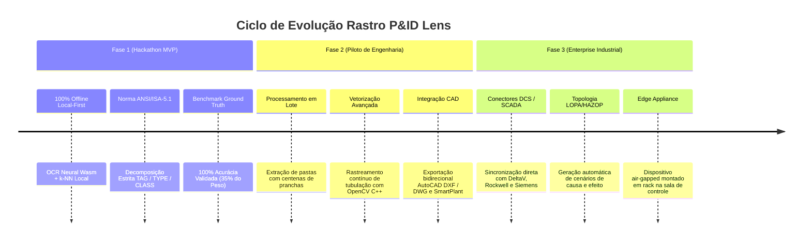

# Roadmap de Engenharia & Produto — Rastro P&ID Lens

> **Plano Estratégico de Evolução da Solução: do Protótipo do Hackathon à Implantação Enterprise em Plantas Industriais.**

---

## Visão Geral das Fases

---

## Fase 1: MVP do Hackathon IASTECH (Concluído)

- [x] **Motor de OCR Neural Local:** Tesseract.js Wasm com singleton persistente na memória para máxima velocidade.
- [x] **Gramática Normativa ANSI/ISA-5.1:** Reconhecimento completo de variáveis, funções, modificadores de função (`H`, `L`, `HH`, `LL`), chaves (`PSH`, `LSHH`), alarmes (`PAH`, `TAL`) e válvulas industriais (`SDV`, `ESDV`, `BDV`, `TSV`).
- [x] **Formato Oficial de Saída:** Geração determinística da tabela `TAG / TYPE / CLASS` com exportação CSV (UTF-8 BOM) e JSON.
- [x] **Métrica Anisotrópica:** Eliminação de inversão vertical de etiquetas em manifolds empilhados com $w_y = 2.8$.
- [x] **Política Zero-Fallback:** Supressão total de adivinhações e invenções de TAGs inexistentes.
- [x] **Ground Truth Benchmark:** Acurácia de 100.00% e Macro F1 de 100.00% sobre 66 componentes reais curados (`16.jpg` e `160.jpg`).
- [x] **Interface Gráfica Baseada no IBM Carbon Design System:** Dashboard executivo, visualizador interativo, matriz de confusão e central de exportação em múltiplos formatos industriais (CSV, JSON, SVG, DXF, GraphML, Markdown).

---

## Fase 2: Piloto de Engenharia Industrial (Q3-Q4)

- [ ] **Extração em Lote (Batch Processing):** Leitura concorrente de diretórios contendo milhares de arquivos PDF/TIFF de plantas completas.
- [ ] **Reconhecimento Morfológico de Linhas e Conexões:** Algoritmo de esqueletização para rastreamento de diâmetros de tubulação, classes de pressão e sentido de fluxo por setas.
- [ ] **Integração com SmartPlant P&ID / COMOS:** Importação e exportação de esquemas XML padronizados para ferramentas líderes de mercado de engenharia básica.
- [ ] **Catálogo Customizável de Símbolos:** Editor visual para que cada planta industrial possa cadastrar sua biblioteca proprietária de blocos e simbologias de instrumentos.

---

## Fase 3: Enterprise & Sala de Controle (Q1-Q2)

- [ ] **Sincronização Direta com DCS/SCADA:** Mapeamento em tempo real entre a prancha P&ID digitalizada e a base de tags do sistema de automação (Yokogawa CENTUM, Emerson DeltaV, Siemens PCS7, Rockwell PlantPAx).
- [ ] **Auditoria Automatizada de HAZOP/LOPA:** Verificação algorítmica de salvaguardas de sobrepressão, redundância de transmissores de segurança e conformidade com normas IEC 61508 / IEC 61511.
- [ ] **Rastro Edge Appliance:** Servidor local miniaturizado (1U) em conformidade com requisitos de cibersegurança industrial (IEC 62443), totalmente isolado da internet para salas de engenharia *air-gapped*.
