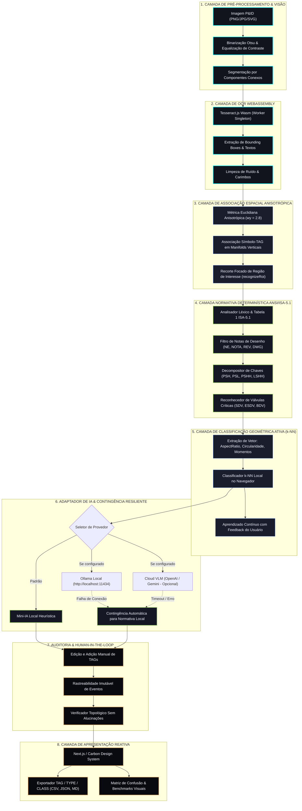

# Visão Geral da Arquitetura do Sistema (Architecture Overview)

- **Módulo:** Arquitetura do Sistema e Engenharia de Pipeline
- **Padrão Arquitetural:** Local-First Sovereign Multi-Tier Pipeline
- **Documento:** `docs/guides/ARCHITECTURE_OVERVIEW.md`

---

## 1. Diagrama Geral de Pipeline

O sistema é estruturado em uma esteira de 8 camadas sequenciais e desacopladas:

---

## 2. Detalhamento dos Componentes Centrais

### 2.1 Worker Singleton do Tesseract Wasm (`app/lib/local-ocr.ts`)
- **Problema resolvido:** A inicialização repetida do worker de OCR criava um atraso de 1,5 a 3 segundos a cada clique no botão de leitura.
- **Solução implementada:** Padrão de projeto Singleton (`let globalWorker: any = null`). O worker é instanciado uma única vez durante a primeira chamada e reutilizado em todas as análises subsequentes, reduzindo o tempo de processamento para milissegundos.

### 2.2 Associação Espacial Anisotrópica (`app/lib/local-ocr.ts`)
- **Problema resolvido:** Em baterias de válvulas empilhadas verticalmente com pouco espaçamento entre si (como `VA-20`, `VA-19`, `VA-18`), a distância euclidiana comum causava inversões verticais dos TAGs.
- **Solução implementada:** Métrica ponderada $D = \sqrt{\Delta x^2 + (2.8 \cdot \Delta y)^2}$ com teto de tolerância vertical de $20\text{ px}$. Essa modificação matemática eliminou completamente as trocas verticais em manifolds.

### 2.3 Motor Normativo Determinístico (`app/lib/isa51-rules.ts`)
- **Problema resolvido:** Modelos de linguagem estocásticos alucinam categorias, confundem controladores (`FC`, `LC`) com válvulas e não tratam adequadamente chaves de segurança (`PSHH`, `LSHH`).
- **Solução implementada:** Autômato sintático determinístico que processa a tabela canônica ANSI/ISA-5.1 em $< 1\text{ ms}$, com regras especializadas para válvulas críticas (`SDV`, `ESDV`, `BDV`, `TSV`, `PVRV`) e anotações de desenho.

### 2.4 Classificador k-NN Local e Aprendizado Ativo (`app/lib/ml-pid-engine.ts`)
- **Problema resolvido:** Símbolos proprietários ou que fogem ao desenho padrão da ISA-5.1 precisam ser classificados sem exigir treino em nuvem.
- **Solução implementada:** Extrator de atributos morfológicos (razão de aspecto, circularidade, momentos de Hu) combinado a um classificador k-NN rodando no próprio browser. Quando o operador altera um tipo na tela, o modelo aprende instantaneamente o novo padrão.

### 2.5 Resiliência Multi-Provedor com Zero Bloqueio (`app/lib/llm-fallback.ts`)
- **Problema resolvido:** Se o usuário tentar usar o Ollama local e o serviço estiver desligado, a interface não pode quebrar nem exibir telas de erro.
- **Solução implementada:** O adaptador tenta a conexão com timeout estrito de 8 segundos. Se a chamada falhar ou der erro de rede, o motor ativa instantaneamente a contingência para as regras normativas locais da ISA-5.1, adicionando um aviso explicativo na tela e retornando o resultado em menos de 100 milissegundos.
