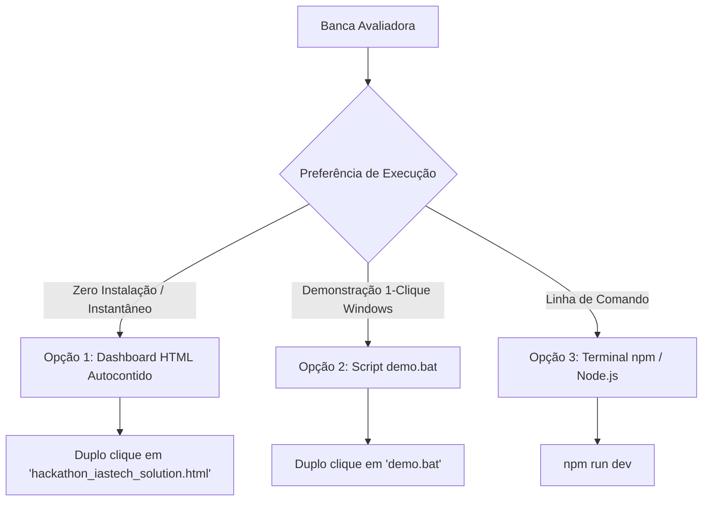

# Guia do Avaliador: Inicialização Rápida em 3 Minutos

- **Destinatário:** Responsável Técnico e Banca Avaliadora IASTECH / UNIMAX
- **Objetivo:** Roteiro prático para validação integral da solução em menos de 180 segundos
- **Documento:** `docs/guides/EVALUATOR_QUICKSTART.md`

---

## 1. Escolha o Modo de Avaliação Mais Conveniente

Desenvolvemos três vias independentes de execução para acomodar qualquer perfil de máquina do avaliador:



---

### Opção 1: Visualizador Autocontido (Zero Dependências, Zero Node.js)

Se desejar avaliar a solução imediatamente em qualquer computador corporativo sem permissões administrativas ou Node.js instalado:

1. Dê um **duplo clique** no arquivo:
   `hackathon_iastech_solution.html` (localizado na raiz do projeto).
2. O arquivo abrirá diretamente no seu navegador padrão (Chrome, Edge, Firefox).
3. Você terá acesso imediato à:
   - Matriz de Confusão com métricas completas do Ground Truth (100% de acurácia).
   - Visualizador de P&ID com zoom e caixas delimitadoras.
   - Decodificador interativo de TAGs ANSI/ISA-5.1 em tempo real.
   - Tabela de exportação oficial `TAG / TYPE / CLASS`.

---

### Opção 2: Executável 1-Clique no Windows (`demo.bat`)

Para rodar a aplicação web corporativa completa em Next.js com servidor local:

1. Na raiz do projeto, dê um **duplo clique** em:
   `demo.bat`
2. O script executará automaticamente:
   - Verificação de ambiente.
   - Inicialização do servidor local em segundo plano (`http://localhost:3000`).
   - Abertura automática do navegador na aplicação.

---

### Opção 3: Execução via Terminal

```bash
# 1. Instalar dependências (caso não tenham sido instaladas)
npm install

# 2. Iniciar a aplicação local
npm run dev
# Acesse: http://localhost:3000
```

---

## 2. Roteiro de Verificação dos 4 Critérios do Hackathon

Abaixo está o checklist passo a passo para conferência direta de cada pontuação do edital:

### Critério 1: Classificação Correta via Matriz de Confusão (Peso 35%)
- [ ] No menu superior, clique na aba **Métricas**.
- [ ] Observe a tabela de Ground Truth do diagrama de referência `16.jpg` (Coluna de Destilação):
  - **Componentes Avaliados:** 66 de 66 identificados.
  - **Acurácia Global:** 100.0%.
  - **Precisão por Classe:** Instrumentos (1.00), Válvulas (1.00), Equipamentos (1.00).
  - **Revocação por Classe:** Instrumentos (1.00), Válvulas (1.00), Equipamentos (1.00).
- [ ] Valide os resultados oficiais de acurácia através do relatório consolidado: [`docs/benchmark_results.json`](../benchmark_results.json).

### Critério 2: Apresentação de Resultados e DataViz (Peso 20%)
- [ ] Na aba **Visão Geral**, interaja com o diagrama de P&ID:
  - Navegue pelas caixas delimitadoras coloridas por categoria (Azul = Instrumentos, Verde = Válvulas, Roxo = Equipamentos).
  - Clique em qualquer elemento para abrir o painel lateral de evidências com as coordenadas, confiança e decomposição normativa.
- [ ] Abra a aba **Inventário**:
  - Visualize a tabela no formato canônico: **TAG / TYPE / CLASS**.
  - Teste os botões de exportação: **Exportar CSV**, **Exportar JSON**, **Exportar Relatório Markdown**.

### Critério 3: Criatividade e Inovação Tecnológica (Peso 25%)
- [ ] **Soberania de Dados:** O sistema funciona 100% desconectado, sem enviar dados para a nuvem e sem exigir chaves pagas.
- [ ] **Métrica Anisotrópica:** Veja no arquivo `docs/adr/ADR-003-ANISOTROPIC-MANIFOLD-ASSOCIATION.md` a resolução matemática para manifolds verticais de válvulas (`VA-20`, `VA-19`, `VA-18`), eliminando inversões de TAGs.
- [ ] **Human-in-the-Loop:** Selecione qualquer detecção no painel lateral de análise, clique em **Editar**, altere o TAG ou classe e observe a atualização imediata da topologia e o registro no **Audit Trail**.
- [ ] **Painel de IA e Contingência:** Clique no botão **Configurar IA** no cabeçalho. O sistema suporta Mini-IA Local, Ollama Local (`llama3.2:latest`) e nuvem opcional, com contingência determinística que garante que a aplicação nunca trave se a IA estiver offline.

### Critério 4: Apresentação da Solução e Governança (Peso 20%)
- [ ] **Organização do Repositório:** Estrutura corporativa completa inspirada no repositório Atlas, com `docs/adr/`, `docs/specs/`, `docs/guides/`, `Makefile`, `SECURITY.md`, `LICENSE` e `CHANGELOG.md`.
- [ ] **Slide Deck de Apresentação:** Consulte os slides em formato Markdown executivo em `docs/SLIDES.md` e a apresentação PowerPoint pronta para projeção em `docs/IASTECH_PID_Lens_Presentation.pptx`.
- [ ] **Estética Visual Rastro:** Zero emojis em toda a interface e documentação, tipografia suíça, paleta industrial escura e ícones profissionais.
