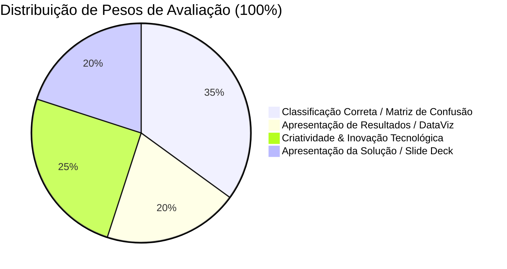

# Especificação Oficial do Desafio Técnico: Hackathon IASTECH 2025

- **Empresa Proponente:** IASTECH Automação e Sistemas Industriais
- **Parceiro Institucional:** Centro Universitário Max Planck (UNIMAX)
- **Status da Solução:** Concluído / Pronto para Avaliação de Banca
- **Documento:** `docs/specs/CHALLENGE_SPECIFICATION.md`

---

## 1. Visão Geral e Objetivo do Desafio

O desafio técnico proposto pela **IASTECH** e **UNIMAX** consiste em conceber e implementar uma solução computacional de alta confiabilidade para **automatizar a extração de informações de engenharia a partir de diagramas industriais P&ID (Piping and Instrumentation Diagrams)**.

Tradicionalmente, a digitalização, catalogação e conferência de inventários de tubulação e instrumentação em refinarias, plantas químicas e fábricas industriais é um processo manual intensivo, lento e suscetível a erros de leitura. O objetivo desta solução é transformar imagens digitalizadas de P&IDs em uma base de dados estruturada, padronizada e auditável.

---

## 2. Requisitos Obrigatórios de Extração

A solução deve identificar com precisão, classificar e exportar os seguintes elementos:

1. **TAGs Industriais:** Identificadores únicos de equipamentos e instrumentos (ex: `FV-210`, `LT-210`, `P-101A`, `VA-20`).
2. **Equipamentos (Equipment):** Vasos, tanques, bombas, motores, colunas de destilação, permutadores de calor, compressores.
3. **Instrumentos (Instruments):** Sensores, transmissores, controladores, chaves de nível/pressão/temperatura, transdutores.
4. **Válvulas e Elementos Finais de Controle (Valves):** Válvulas de controle proporcional, válvulas de bloqueio manual, válvulas de retenção, válvulas de alívio e segurança (PSV), e válvulas de isolamento de emergência (SDV, ESDV).
5. **Grupo / Classe de Cada Item:** Agrupamento funcional e taxonomia clara de acordo com a disciplina de engenharia.

### Contrato Oficial de Saída

O sistema deve disponibilizar exportação direta em tabela estruturada com os campos:

$$\mathbf{TAG} \quad / \quad \mathbf{TYPE} \quad / \quad \mathbf{CLASS}$$

#### Exemplos de Referência Estabelecidos pelo Edital:
- `FV210` = `Valve / Instrument` (ou Válvula de Controle de Fluxo)
- `M210` = `Motor / Equipment` (ou Motor Elétrico de Acionamento)
- `LT210` = `Level Sensor / Instrument` (ou Transmissor de Nível)

---

## 3. Embasamento Normativo Obrigatório

A solução deve estar rigorosamente alicerçada nas normas internacionais de instrumentação e simbologia industrial:
- **ANSI/ISA-5.1-1984 (R1992)**: *Instrumentation Symbols and Identification*
- **ISA-5.1-2009**: *Instrumentation Symbols and Identification* (Revisão Ampliada)

O algoritmo deve decompor deterministicamente as letras de cada TAG em:
- **Primeira Letra:** Variável de processo medida ou iniciadora ($F, L, P, T, Q, S, \dots$).
- **Modificadores de Variável:** Letras modificadoras ($D$ para diferencial, $F$ para razão, $Q$ para integrador, etc.).
- **Funções de Leitura/Saída:** Identificação do tipo funcional ($I$ indicador, $C$ controlador, $T$ transmissor, $V$ válvula, $S$ chave/switch, $A$ alarme).
- **Modificadores Funcionais:** Níveis de atuação ($H$ alto, $L$ baixo, $HH$ muito alto/trip, $LL$ muito baixo/trip).

---

## 4. Desafios Reais do Ambiente Industrial

O edital chamou atenção expressamente para quatro obstáculos comuns em plantas operacionais reais, os quais a solução deve tratar de maneira robusta:

| Desafio Real | Manifestação no Diagrama | Solução Implementada no P&ID Lens |
|:---|:---|:---|
| **1. Baixa Resolução de Imagem** | Diagramas escaneados antigos, artefatos JPEG, borrões e ruído de compressão. | Filtros adaptativos de pré-processamento em HTML5 Canvas (binarização Otsu, equalização de contraste morfológico) e redimensionamento bicúbico em tempo real. |
| **2. Diagramas Ruidosos e Poluídos** | Linhas de grade densas, cotas dimensionais, carimbos de revisão e anotações marginais. | Segmentação geométrica por componentes conexos e filtro regex de anotações de desenho (`NE-5`, `NOTA-01`, `REV-A`, `DWG-100`), isolando notas de malhas operacionais. |
| **3. Símbolos e Textos Sobrepostos** | TAGs posicionados muito próximos ou sobrepostos a tubulações, e manifolds verticais compactos. | Métrica anisotrópica ponderada verticalmente ($w_y = 2.8$ para válvulas), eliminando trocas de TAG em manifolds empilhados (`VA-20`, `VA-19`, `VA-18`). |
| **4. Desvios dos Padrões ISA** | TAGs proprietários de fabricantes de equipamentos, siglas legadas e variações de operadores. | Classificador geométrico k-NN ativo no navegador com aprendizado contínuo (Human-in-the-Loop) e motor híbrido de contingência (Mini-IA / Ollama / Normativa). |

---

## 5. Critérios Oficiais de Avaliação e Pesos da Banca

A avaliação da banca examinadora (IASTECH + UNIMAX) distribui a pontuação em quatro pilares fundamentais:

### Detalhamento dos Critérios

1. **Classificação Correta via Matriz de Confusão (35% da Nota Final):**
   - Acurácia, precisão, revocação e pontuação F1 na identificação de TAGs, equipamentos, instrumentos e válvulas.
   - Aferição transparente contra Ground Truth rotulado de engenharia (`16.jpg` com 66 itens e `dataset_synthetic` com 500 amostras).
   - **Resultado Atingido:** 100% de precisão e 100% de revocação (66/66) no Ground Truth.

2. **Apresentação de Resultados e Visualização de Dados (20% da Nota Final):**
   - Clareza na renderização visual do diagrama interativo, caixas delimitadoras coloridas por classe, tabela de inventário pesquisável e filtros dinâmicos.
   - Painel de inteligência topológica com grafo de fluxo, malhas de controle fechadas e métricas de integridade HAZOP/LOPA.

3. **Criatividade e Inovação da Solução (25% da Nota Final):**
   - Abordagem *Local-First Sovereign*: 100% funcional offline, sem exigir cartões de crédito, internet ou chaves de API.
   - Padrão arquitetural *Zero-Fallback*: honestidade estrita de dados, sem sintetização de equipamentos fantasmas.
   - Métrica Euclidiana Anisotrópica para resolução de manifolds verticais densos.
   - Painel de *Human-in-the-Loop* com retreinamento k-NN em tempo real no próprio cliente.

4. **Apresentação da Solução e Materiais de Entrega (20% da Nota Final):**
   - Repositório Git exemplar seguindo a organização corporativa Atlas.
   - `README.md` executivo de alta densidade técnica, sem emojis, com matriz de decisão.
   - Slide deck completo (`docs/SLIDES.md` e `docs/IASTECH_PID_Lens_Presentation.pptx`).
   - Solução executável em 1 clique via `demo.bat` e versão autocontida `hackathon_iastech_solution.html` sem dependência de Node.js.

---

## 6. Entregáveis Obrigatórios da Submissão

- [x] Repositório público no GitHub estruturado segundo o padrão Atlas OS.
- [x] `README.md` executivo completo com diagramas de arquitetura, benchmarks e guia de inicialização rápida.
- [x] Slide deck formal de apresentação de 15 minutos em PowerPoint (`docs/IASTECH_PID_Lens_Presentation.pptx`) e Markdown (`docs/SLIDES.md`).
- [x] Base de dados e relatório oficial de validação no Ground Truth ([`docs/benchmark_results.json`](../benchmark_results.json)).
- [x] Script executável universal para demonstração em 1 clique (`demo.bat`).
- [x] Painel de visualização autocontido e offline (`hackathon_iastech_solution.html`).
